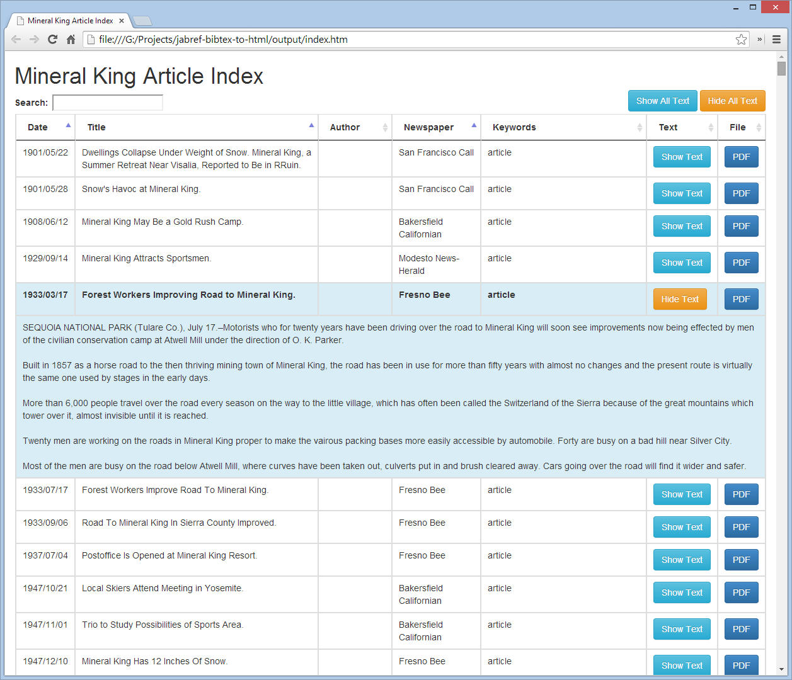

jabref-bibtex-to-html
=====================

Converts an export from [JabRef](http://jabref.sourceforge.net/) in [BibTeX](http://bibtexml.sourceforge.net/) XML format to a sortable and searchable standalone HTML document

Requirements
------------

  Python 2.6+

Options
-------

|Name             |Description                                |
|-----------------|-------------------------------------------|
| --input-xml     | Path to your BibTeX XML export (Required) |
| --project-title | Your project's title (Required)           |

Usage
-----

Export your JabRef project as the BibTeX XML format. Then use the file as the input to this application.

```
python main.py --input-xml data\mk-bibtexml.xml --project-title "Mineral King"
```

Output
------

Here's what the resulting output looks like when viewed in Chrome


